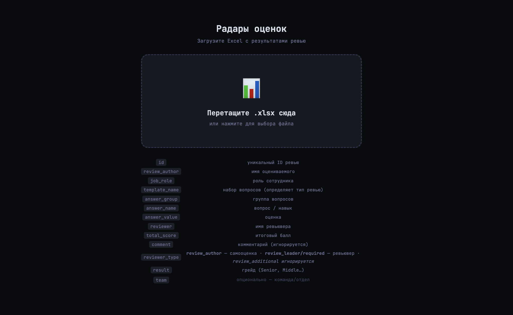
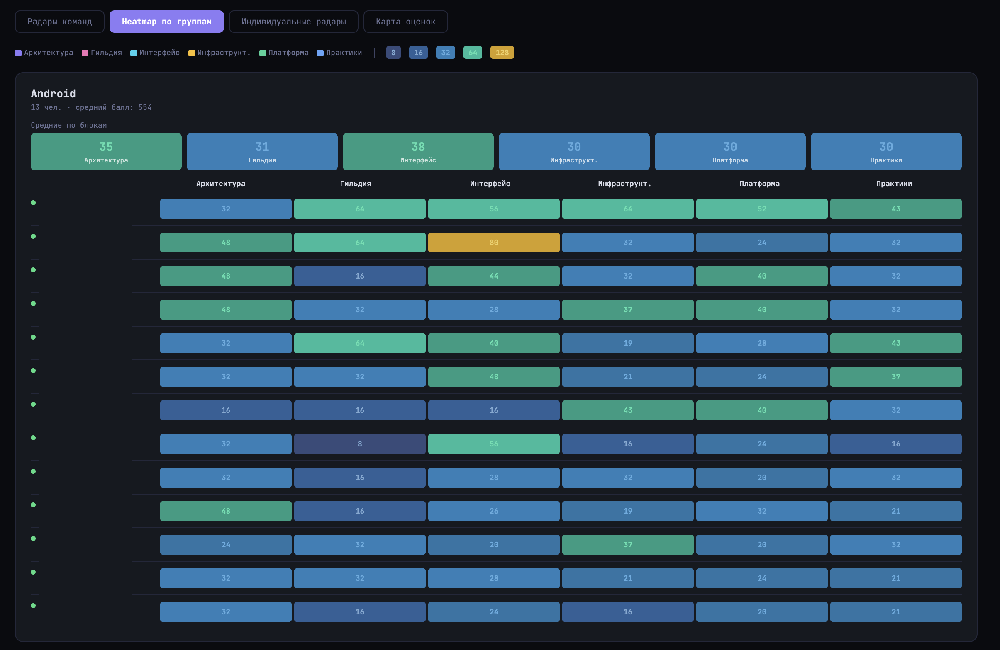

# ReviewRadar

> Интерактивный дашборд для визуализации результатов performance review

ReviewRadar превращает выгрузку из системы ревью в набор радаров компетенций, тепловых карт и матриц навыков. Загрузи `.xlsx` — и сразу видишь кто где стоит, где пробелы, и как самооценка расходится с оценкой ревьювера.

Работает для любых ролей: разработчики, дизайнеры, аналитики, менеджеры — всё определяется из файла, ничего не захардкожено.

---

## Быстрый старт

Никакой установки. Просто открой `index.html` в браузере и загрузи файл.

```
Скачай → Открой index.html → Загрузи .xlsx → Готово
```

---

## Скриншоты



<table>
  <tr>
    <td></td>
    <td></td>
  </tr>
  <tr>
    <td></td>
    <td></td>
  </tr>
</table>

---

## Возможности

- **Радары команд** — сравнение средних баллов по группам навыков между командами и типами ролей
- **Heatmap по группам** — тепловая карта с цветовым кодированием по уровню оценки
- **Индивидуальные радары** — личный профиль каждого сотрудника с детальной разбивкой по навыкам
- **Карта оценок** — полная матрица навыков с gap-анализом (самооценка − оценка ревьювера)
- **Динамическая схема** — группы навыков, типы ролей, грейды и команды берутся из файла
- **Приоритет ревьюверов** — `review_leader` → `review_required`, самооценки (`review_author`) хранятся отдельно, `review_additional` игнорируется

---

## Формат файла

`.xlsx` с листом, содержащим следующие колонки:

| Колонка | Описание |
|---|---|
| `id` | Уникальный ID ревью |
| `review_author` | Имя сотрудника |
| `job_role` | Роль сотрудника |
| `template_name` | Набор вопросов (определяет тип ревью) |
| `answer_group` | Группа вопросов / блок навыков |
| `answer_name` | Конкретный вопрос / навык |
| `answer_value` | Числовая оценка |
| `answer_weight` *(опционально)* | Коэффициент оценки (целое, умножает `answer_value`; по умолч. 1) |
| `reviewer` | Имя ревьювера |
| `total_score` | Итоговый балл ревьювера |
| `comment` *(опционально)* | Комментарий (игнорируется) |
| `reviewer_type` | Тип ревьювера (см. ниже) |
| `result` | Грейд (Senior, Middle, Junior и т.д.) |
| `team` *(опционально)* | Команда или отдел |

### Типы ревьюверов

| `reviewer_type` | Роль |
|---|---|
| `review_author` | Самооценка сотрудника |
| `review_leader` | Основной ревьювер (высший приоритет) |
| `review_required` | Обязательный ревьювер (используется если нет leader) |
| `review_additional` | Дополнительный ревьювер (игнорируется) |

---

## Как читать визуализации

**Цветовая шкала оценок:**

| Цвет | Значение |
|---|---|
| 🔵 Синий | 8–32 — базовый уровень |
| 🟢 Зелёный | 48–64 — уверенный уровень |
| 🟡 Жёлтый | 128+ — экспертный уровень |

**Gap (в карте оценок):**
- 🔴 `+16` и выше — переоценка (самооценка выше оценки ревьювера)
- 🟢 `−16` и ниже — недооценка (ревьювер оценил выше)

---

## Технологии

- Vanilla JS — без фреймворков, без сборки
- [SheetJS](https://shejs.io) — парсинг `.xlsx` прямо в браузере
- [Chart.js](https://chartjs.org) — радарные диаграммы
- Один файл `index.html` — можно просто переслать коллеге

---

## Структура проекта

```
reviewradar/
└── index.html   # всё приложение в одном файле
```

---

## Лицензия

MIT
